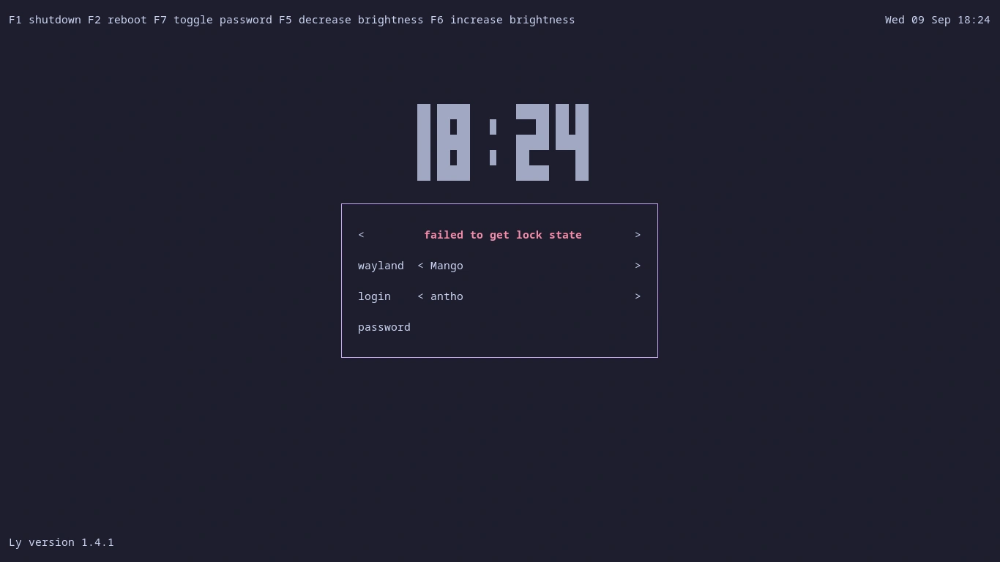

# System Configurations (Ly & Limine)

<p align="center">
  <a href="https://github.com/anthonyportugal/dotfiles-system/actions/workflows/ci.yml"></a>
  <a href="https://kernel.org"></a>
  <a href="https://archlinux.org"></a>
  <a href="https://cachyos.org"></a>
  <a href="https://codeberg.org/fairyglade/ly"></a>
  <a href="https://limine-bootloader.org/"></a>
  <a href="https://github.com/catppuccin/catppuccin"></a>
  <a href="LICENSE"></a>
</p>

*Read this in other languages:* [Español](README.es.md)

Modular, reproducible, and non-destructive system-level configurations and theming for **Arch Linux** and **CachyOS**. Manages display manager ([Ly](https://codeberg.org/fairyglade/ly)) and bootloader ([Limine](https://limine-bootloader.org/)) styling using the unified **Catppuccin Mocha** palette, backed by fail-safe automatic backups and idempotent deployment scripts.

<p align="center">
  
</p>

> [!TIP]
> 🧩 **Modular Dotfiles Ecosystem:**  
> [Base & CLI](https://github.com/anthonyportugal/dotfiles) • [MangoWM (Wayland)](https://github.com/anthonyportugal/dotfiles-mangowm) • [BSPWM (X11)](https://github.com/anthonyportugal/dotfiles-bspwm) • [Wallpapers](https://github.com/anthonyportugal/walls) • **System Layer [Current]**
> 
> While userland configurations live in `$HOME` and are deployed without privileges via GNU Stow, system-level components requiring root privileges (`/etc`, `/boot`) are cleanly isolated in this repository for maximum stability and security.

---

## ✨ Key Highlights

- 🛡️ **Non-Destructive Bootloader Theming:** Pure palette injection into `limine.conf`. Kernel command lines, initramfs paths, boot timeout, and partition UUIDs remain 100% untouched.
- 📦 **Timestamped Safety Backups:** Automatically creates immutable, timestamped backups (`.bak_YYYYMMDD_HHMMSS`) before modifying `/etc/ly/config.ini` or `/boot/limine.conf`.
- 🔁 **Strict Idempotency:** Running scripts multiple times never duplicates lines or pollutes configuration blocks.
- ⚡ **Assisted Package Installation:** Auto-detects your system package manager following ecosystem priority (`shelly` → `paru` → `yay` → `pacman`) and offers to install missing components automatically.
- 🧪 **Automated Testing & CI:** Verified through GitHub Actions and an unprivileged 16-assertion test suite covering shell syntax, ShellCheck linting, and bootloader idempotency mocks.
- 🔍 **Dry-Run & System Audit:** Complete simulation mode (`--dry-run`) and diagnostic audit (`--check`) to inspect targets without making system changes.
- 🕒 **Minimalist Ly Display Manager:** Clean TUI login screen with central digital clock (`bigclock = en`), real-time top clock (`%a %d %b %H:%M`), Catppuccin Mocha palette, true color support, and zero visual bloat.
- 🎨 **Official Catppuccin Limine Palettes:** Sourced directly from [catppuccin/limine](https://github.com/catppuccin/limine), featuring Mauve (default), Pink, and Blue accents.
- 🔒 **Encrypted DNS-over-TLS (DoT):** Native system-wide encrypted DNS via systemd-resolved and Quad9 (9.9.9.9) with Cloudflare fallback, zero background daemons.

---

## 🧱 Repository Structure

```text
dotfiles-system/
├── .github/workflows/ci.yml     # Automated ShellCheck and test suite CI
├── install.sh                  # Unified master installer (CLI flags + interactive menu)
├── LICENSE                     # MIT License
├── README.md                   # English documentation
├── README.es.md                # Spanish documentation
├── dns/
│   ├── providers/              # Preconfigured DoT provider profiles
│   │   ├── adguard.conf        # AdGuard DNS (ad and tracker blocking)
│   │   ├── cloudflare.conf     # Cloudflare 1.1.1.1 (ultra-fast, general purpose)
│   │   ├── cloudflare-security.conf # Cloudflare 1.1.1.2 (malware & phishing protection)
│   │   ├── mullvad.conf        # Mullvad DNS (zero-logging, privacy)
│   │   └── quad9.conf          # Quad9 9.9.9.9 (default, threat & malware blocking)
│   └── setup.sh                # Modular installer for /etc/systemd/resolved.conf.d/
├── ly/
│   ├── config.ini              # Catppuccin Mocha configuration (INI for Ly <= 1.4)
│   ├── config.lua              # Catppuccin Mocha configuration (Lua for Ly >= 1.5+)
│   ├── startup.sh              # Linux Virtual Terminal (TTY) Catppuccin Mocha palette script
│   └── setup.sh                # Modular installer for /etc/ly/
├── limine/
│   ├── catppuccin-mocha.conf   # Active default theme (Mauve)
│   ├── setup.sh                # Non-destructive palette injector for limine.conf
│   └── themes/
│       ├── catppuccin-mocha-blue.conf
│       ├── catppuccin-mocha-mauve.conf
│       └── catppuccin-mocha-pink.conf
└── tests/
    └── test_suite.sh           # Standalone automated test harness (unprivileged)
```

---

## 🚀 Installation & Usage

### 1. Clone Repository

```bash
git clone https://github.com/anthonyportugal/dotfiles-system.git
cd dotfiles-system
```

### 2. Audit System State (Safe Check)

Before applying any changes, you can verify which components are installed and where configurations reside:

```bash
./install.sh --check
```

### 3. Dry-Run Simulation

Simulate the deployment to preview exact actions and paths without modifying the filesystem:

```bash
sudo ./install.sh --dry-run
```

### 4. Deploy Configurations

#### Option A: Unified Master Installer (Recommended)

```bash
# Interactive selection menu
sudo ./install.sh

# Or non-interactive installation of all components
sudo ./install.sh --all

# Auto-install missing packages (shelly/paru/yay/pacman)
sudo ./install.sh --all --install

# Select a custom Limine accent (mauve, pink, blue)
sudo ./install.sh --all --theme pink

# Composable flags: install only Ly and DNS (skip Limine)
sudo ./install.sh --ly --dns --provider quad9
```

#### Option B: Modular Installation

You can install or update components individually:

* **DNS-over-TLS (DoT) only:**
  ```bash
  # Deploy default provider (Quad9 9.9.9.9)
  sudo ./dns/setup.sh

  # Or select a preset: quad9, cloudflare, cloudflare-security, adguard, mullvad
  sudo ./dns/setup.sh --provider adguard

  # Or specify custom DoT endpoints (e.g. NextDNS)
  sudo ./dns/setup.sh --custom "45.90.28.0#my-id.dns.nextdns.io"
  ```

* **Ly Display Manager only:**
  ```bash
  # Deploy theme files
  sudo ./ly/setup.sh

  # Or deploy and automatically install the package if missing
  sudo ./ly/setup.sh --install
  ```
  *To enable Ly as your system default display manager:*
  ```bash
  sudo systemctl enable ly@tty1.service
  ```

* **Limine Bootloader only:**
  ```bash
  # Installs default (Mauve)
  sudo ./limine/setup.sh

  # Or specify accent
  sudo ./limine/setup.sh --theme pink

  # If your config is at a custom path
  sudo ./limine/setup.sh --config /path/to/limine.conf
  ```

> [!NOTE]
> **CachyOS Secure Boot:**  
> If you have Secure Boot enabled with Limine 11.2+, pass `--enroll` to update the BLAKE2B config checksum automatically:
> ```bash
> sudo ./limine/setup.sh --enroll
> ```

---

## 🧪 Automated Testing

The repository includes a comprehensive, non-destructive test suite that runs in an isolated, unprivileged environment without modifying any system files:

```bash
./tests/test_suite.sh
```

Tests include:
1. **Shell Script Syntax:** Static validation (`bash -n`) for all scripts.
2. **Lua Bytecode Syntax:** Bytecode compilation and parse validation for `ly/config.lua`.
3. **Ly Tokens & Palette:** Confirms `start_cmd`, `bigclock = en`, and 16-color TTY escape declarations.
4. **Theme Files Integrity:** Verifies `mauve`, `pink`, and `blue` theme files.
5. **Bootloader Idempotency & Safety:** 3-pass injection mock ensuring kernel lines, initramfs, and UUIDs are never damaged or duplicated.
6. **CLI Diagnostics & Dry-Run:** Asserts that `--check`, `--dry-run`, and `--help` flags operate cleanly.

---

## 🔄 Rollback & Recovery

Because every execution creates a timestamped backup before touching target files, restoring an earlier state is straightforward:

### Restore Ly Configuration
```bash
# List available backups
ls -la /etc/ly/config.ini.bak_*

# Restore desired backup
sudo cp /etc/ly/config.ini.bak_<TIMESTAMP> /etc/ly/config.ini
```

### Restore Limine Configuration
```bash
# List available backups
ls -la /boot/limine*.bak_* /boot/limine/*.bak_* 2>/dev/null

# Restore desired backup
sudo cp /boot/limine.conf.bak_<TIMESTAMP> /boot/limine.conf
```

---

## 📄 License & Acknowledgements

- **License:** Distributed under the [MIT License](LICENSE).
- **Themes:** Color palettes inspired by and sourced from the [Catppuccin Project](https://github.com/catppuccin/catppuccin) and [catppuccin/limine](https://github.com/catppuccin/limine).
- **Upstream Projects:**
  - [Ly Display Manager](https://codeberg.org/fairyglade/ly)
  - [Limine Bootloader](https://limine-bootloader.org/)
